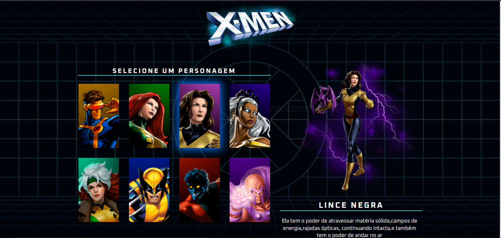

<h1 align="center"> Seletor de Personagens dos X-Men </h1>

O projeto "Seletor de Personagens dos X-Men" é um projeto promovido pela Dev em Dobro com o objetivo de proporcionar um ambiente de aprendizado das tecnologias web.

 

  

## 🚀 Tecnologias

Esse projeto foi desenvolvido com as seguintes tecnologias:

- HTML e CSS
- JavaScript
- Git e Github

